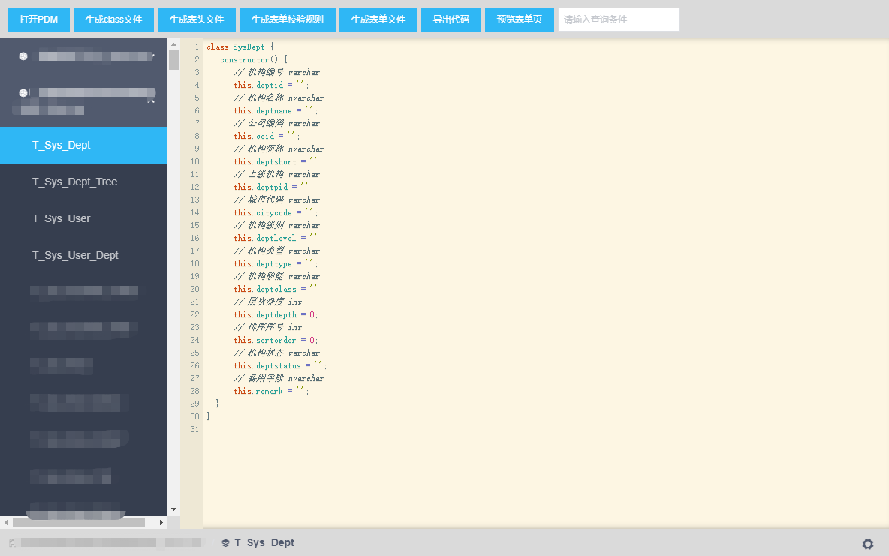
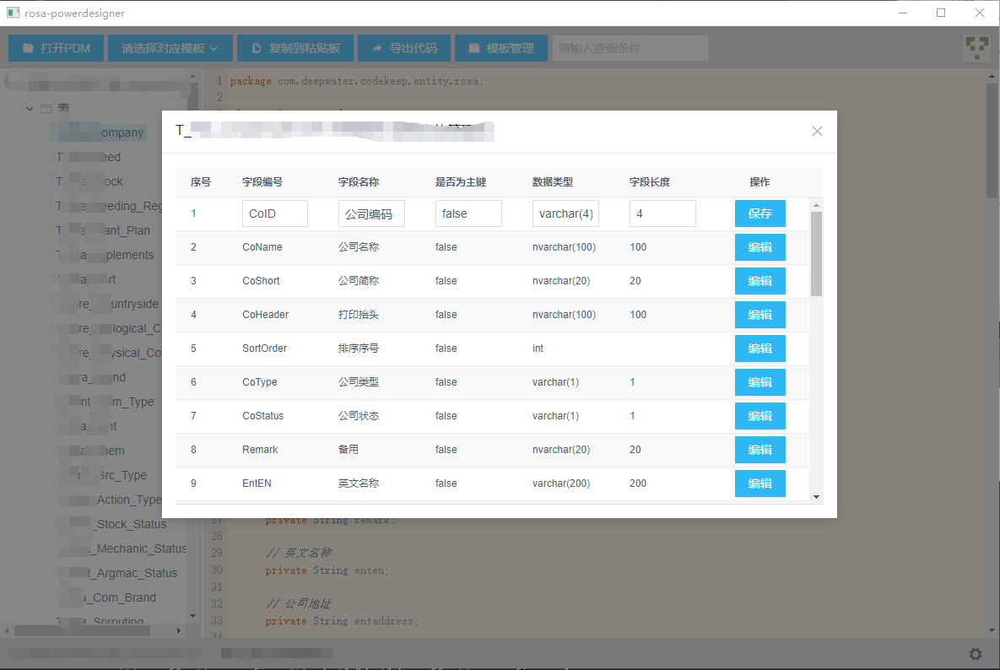

# Rosa PowerDesigner

这是一个基于[Electron](https://electronjs.org/)的代码生成工具，根据powerdesign PDM 文件生成相应代码。
> 在前端工作中遇到了一些重复性的工作，所以想到了制作一个代码生成工具，日常的开发工作主要围绕PDM与客户需求展开，考虑到目前有些项目不一定适用PowerDesigner进行表结构设计，后期考虑通过连接数据库获取表结构。





**warning**: 目前对于powerdesign16.0及powerdesign16.5生成的PDM文件的解析是没有问题的，对于其他版本的PDM解析如果存在问题，请在issues当中提出，最好提供PDM文件。

## 如何使用

``` bash
# 拉取源码
git clone https://github.com/jingchenxu/rosa-powerdesigner.git
# 进入根目录
cd rosa-powerdesigner
# 安装依赖并运行项目
yarn
yarn run electron:serve
```

打包应用

``` shell
yarn run electron:build
```

## Features ([CHANGELOG](CHANGELOG.md))

- 支持生成ES6语法的类；
- 支持生成iview Table 组件所使用的表头；
- 支持生成iview Form 组件所使用的校验文件；
- 支持生成iview 表单组件；

#### [下载APP](https://github.com/jingchenxu/rosa-powerdesigner/releases)

#### License [MIT](LICENSE.md)


https://gitee.com/hzhh123/electron-demo1
https://segmentfault.com/a/1190000012904543
