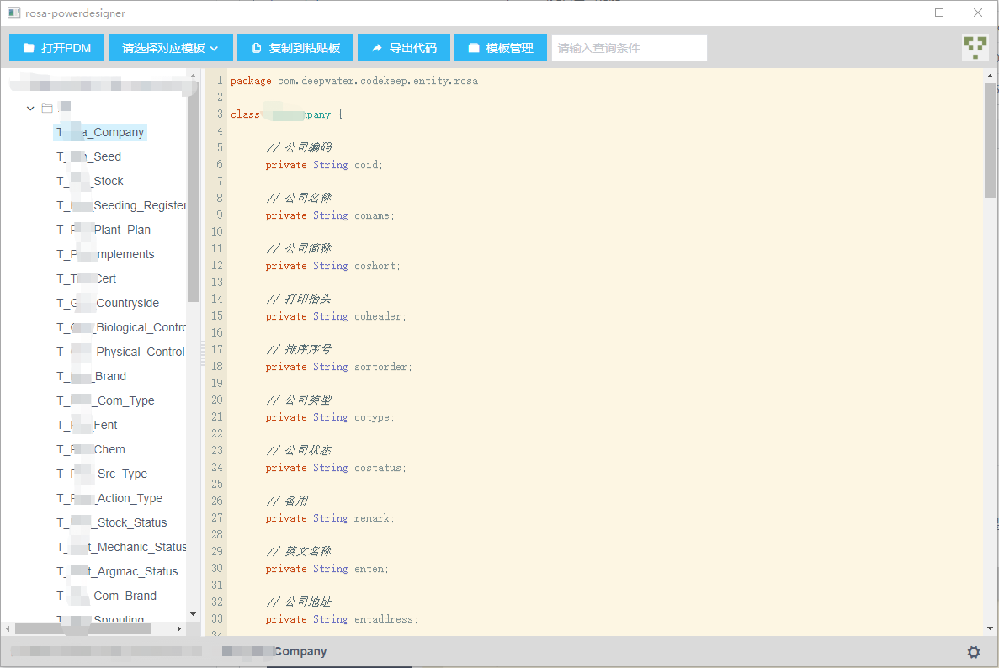

# Rosa PowerDesigner

这是一个基于[Electron](https://electronjs.org/)的代码生成工具，根据powerdesign PDM 文件生成相应代码。
> 在前端工作中遇到了一些重复性的工作，所以想到了制作一个代码生成工具，日常的开发工作主要围绕PDM与客户需求展开，考虑到目前有些项目不一定适用PowerDesigner进行表结构设计，后期考虑通过连接数据库获取表结构。




**warning**: 目前对于powerdesign16.0及powerdesign16.5生成的PDM文件的解析是没有问题的，对于其他版本的PDM解析如果存在问题，请在issues当中提出，最好提供PDM文件。

## 如何使用

``` bash
# 拉取源码
git clone https://github.com/jingchenxu/rosa-powerdesigner.git
# 进入根目录
cd rosa-powerdesigner
# 安装依赖并运行项目
yarn
yarn run electron:serve
```

打包应用

``` shell
yarn run electron:build
```

## ✨ Features ([CHANGELOG](CHANGELOG.md))

- 支持解析pdm文件;
- 支持本地模板及在线模板，代码根据模板生成；
- 支持文件导出及代码复制至粘贴板。

#### [下载APP](https://github.com/jingchenxu/rosa-powerdesigner/releases)

## 🛠 技术栈

- [Electron](https://electronjs.org/)
- [Vue](https://vuejs.org/) + [VueX](https://vuex.vuejs.org/) + [Element](https://element.eleme.io)

